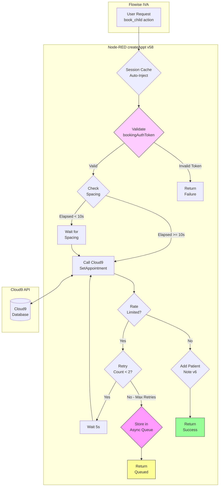
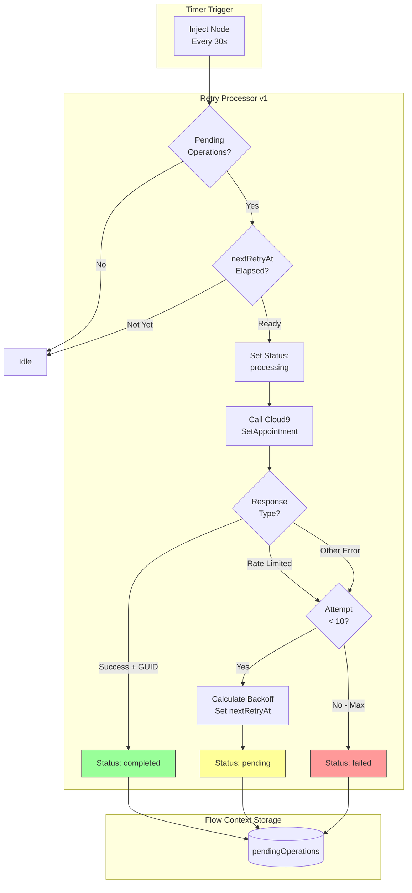
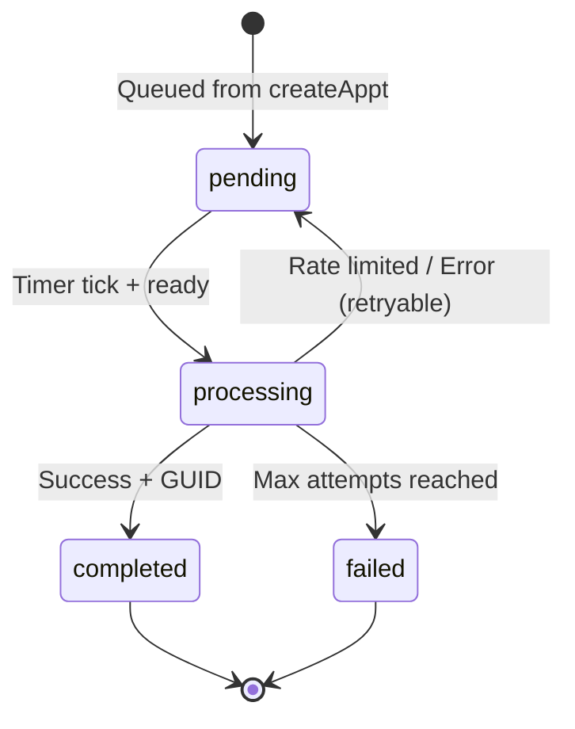

# Node-RED Async Queue Architecture

> **Version:** 2.0
> **Last Updated:** January 2026
> **Components:** createAppt function (v58), Retry Processor (v1)

---

## Table of Contents

1. [Problem Statement](#1-problem-statement)
2. [Solution Overview](#2-solution-overview)
3. [Visual Flow Diagram](#3-visual-flow-diagram)
4. [Component Details](#4-component-details)
   - 4.1 [createAppt Function (v58)](#41-createappt-function-v58)
   - 4.2 [Booking Auth Token Validation (v7)](#42-booking-auth-token-validation-v7)
   - 4.3 [Parent-as-Patient Model with Notes (v6)](#43-parent-as-patient-model-with-notes-v6)
   - 4.4 [Session Cache Auto-Injection (v57/v58)](#44-session-cache-auto-injection-v57v58)
   - 4.5 [Retry Processor (v1)](#45-retry-processor-processretryqueue---v1)
   - 4.6 [Queue Status Endpoint](#46-queue-status-endpoint)
5. [Input/Output Specifications](#5-inputoutput-specifications)
6. [Configuration](#6-configuration)
7. [Two Token Systems](#7-two-token-systems)
8. [Monitoring Endpoints](#8-monitoring-endpoints)

---

## 1. Problem Statement

### The Challenge

The Cloud9 Ortho API enforces strict rate limiting (~5 requests/minute for write operations like `SetAppointment`). This creates significant problems for the IVA (Intelligent Voice Assistant) booking experience:

| Issue | Impact |
|-------|--------|
| **Dead Air** | Caller experiences silence while waiting for retries |
| **Booking Failures** | Rate-limited requests fail, requiring caller callback |
| **Sibling Bookings** | Consecutive appointments for multiple children trigger rate limits |
| **Poor UX** | Callers perceive system as slow or broken |

### Rate Limit Behavior

When Cloud9 receives too many requests, it returns:
```xml
<GetDataResponse>
    <ResponseStatus>Error</ResponseStatus>
    <ErrorMessage>Too many requests</ErrorMessage>
</GetDataResponse>
```

Error detection pattern: `/too many requests|rate limit/i`

---

## 2. Solution Overview

### Two-Layer Retry Strategy

The architecture implements a **two-layer defense** against rate limits:

| Layer | Purpose | Max Duration | Behavior |
|-------|---------|--------------|----------|
| **Layer 1: Sync Retry** | Minimize dead air | ~10 seconds | 2 attempts with 5s delay |
| **Layer 2: Async Queue** | Guarantee delivery | ~5 minutes | Background retry with exponential backoff |

### Key Design Principles

1. **Fail Fast to IVA** - Return a "queued" response quickly so the IVA can continue the conversation
2. **Guarantee Delivery** - Background processor ensures the appointment eventually gets created
3. **Booking Authorization** - HMAC-signed tokens prevent unauthorized bookings (v7)
4. **Graceful Degradation** - IVA can inform caller that confirmation will come "shortly"

---

## 3. Visual Flow Diagram

### Main Request Flow



### Async Queue Processing



### State Machine



---

## 4. Component Details

### 4.1 createAppt Function (v58)

**Version History (from code):**
```javascript
// v58: Look up session cache by patientGUID (most reliable) or fallback to UUI
// v57: FIXED sessionId bug - define BEFORE using in cache lookup
// v6: PARENT-AS-PATIENT MODEL - Add note support via SetPatientComment
// v5.1: Reduced sync retries to 2 (~10s max) for better IVA UX
// v5: Async queue for rate-limited requests
// v4: Two-layer rate limit handling: automatic spacing + progressive retry
// v3: Added rate limit retry logic with 10s delay
// v2: Enhanced error logging
```

**Responsibilities:**
- Session cache lookup and auto-injection of bookingAuthToken/patientGUID (v57/v58)
- Booking auth token validation with HMAC-SHA256 (v7)
- Input validation (patientGUID, startTime, scheduleViewGUID, scheduleColumnGUID)
- Layer 1: Automatic spacing (10s between calls)
- Layer 2: Sync retry (2 attempts, 5s delay)
- Queue storage for rate-limited requests
- Patient note creation via `SetPatientComment` (v6)
- LLM guidance generation for IVA

**Key Code Configuration:**

```javascript
// Layer 1: Automatic spacing
const BOOKING_SPACING_MS = 10000;  // 10s minimum between calls

// Layer 2: Quick sync retry
const RETRY_CONFIG = {
    maxRetries: 2,
    retryDelays: [5000]  // Single 5s retry before queueing
};

// Chair 8 hardcoded (current limitation)
ScheduleColumnGUID: '07687884-7e37-49aa-8028-d43b751c9034', // CHAIR 8

// Error patterns
const ERROR_PATTERNS = {
    RATE_LIMIT: /too many requests|rate limit/i,
    PATIENT_NOT_FOUND: /patient.*guid.*does not exist/i,
    SLOT_NOT_AVAILABLE: /slot.*not available|time.*not available|already.*booked/i,
    // ... other patterns
};
```

---

### 4.2 Booking Auth Token Validation (v7)

**Purpose:** Prevents unauthorized booking requests by requiring a cryptographically signed token.

**Token Structure:**
```javascript
{
    sessionId: "765381306-000000...",
    patientGUID: "877F0034-7E09-4E35-BE0D-397E309DF2E8",
    createdAt: 1768822558209,
    expiresAt: 1768823458209,  // 15 minutes TTL
    nonce: "5b0b1d22ff73"
}
```

**Token Format:** `<base64url-payload>.<base64url-hmac-signature>`

**Validation Flow:**

```javascript
function validateBookingAuth(params, sessionId) {
    const BOOKING_SECRET = env.get('bookingAuthSecret') || 'CDH-Ortho-BookingAuth-2026';

    // Check 1: Token present?
    if (!params.bookingAuthToken) {
        // Backward compat: session_match or legacy GUID format
        // ...
        return { valid: false, error: 'BOOKING_AUTH_MISSING' };
    }

    // Check 2: Verify HMAC signature
    const [payloadB64, signatureB64] = params.bookingAuthToken.split('.');
    const expectedSig = crypto.createHmac('sha256', BOOKING_SECRET)
        .update(payloadB64).digest('base64url');
    if (signatureB64 !== expectedSig) {
        return { valid: false, error: 'BOOKING_AUTH_SIGNATURE_INVALID' };
    }

    // Check 3: Parse token payload
    const tokenData = JSON.parse(Buffer.from(payloadB64, 'base64url').toString('utf8'));

    // Check 4: Token not expired (15 min TTL)
    if (Date.now() > tokenData.expiresAt) {
        return { valid: false, error: 'BOOKING_AUTH_EXPIRED' };
    }

    // Check 5: patientGUID matches token
    if (params.patientGUID !== tokenData.patientGUID) {
        return { valid: false, error: 'BOOKING_AUTH_GUID_MISMATCH' };
    }

    return { valid: true, authorizedPatientGUID: tokenData.patientGUID, method: 'token' };
}
```

**Three Auth Methods:**

| Method | Condition | Description |
|--------|-----------|-------------|
| `token` | Valid HMAC token provided | Full validation passed |
| `session_match` | No token but session GUID matches | Backward compatibility |
| `legacy` | No token but valid GUID format | Existing patient case |

---

### 4.3 Parent-as-Patient Model with Notes (v6)

**Purpose:** Supports sibling bookings by storing child info in patient comments.

**Flow:**
1. Parent is created as the "patient" record once
2. Each child's info stored via `SetPatientComment` API
3. Same `patientGUID` reused for all children's appointments

**Note Function:**

```javascript
async function addPatientNote(patientGUID, note) {
    if (!note || !patientGUID) return { success: true, skipped: true };

    const xmlRequest = buildXmlRequest('SetPatientComment', {
        patGUID: patientGUID,
        patComment: note
    });

    const response = await fetch(CLOUD9.endpoint, {
        method: 'POST',
        headers: { 'Content-Type': 'application/xml' },
        body: xmlRequest,
        timeout: 15000
    });

    // ... parse and return result
}
```

**Note Format:**
```
Child: Tommy | DOB: 01/15/2015 | Insurance: Aetna | GroupID: G123 | MemberID: 456
```

**When Called:** After successful appointment creation, if `params.note` is provided.

---

### 4.4 Session Cache Auto-Injection (v57/v58)

**Purpose:** Handles cases where LLM doesn't pass the bookingAuthToken by looking up cached session data.

**Flow Context Variable:**
```javascript
// bookingSessions structure (keyed by patientGUID and UUI)
{
    "877F0034-7E09-4E35-BE0D-397E309DF2E8": {
        patientGUID: "877F0034-7E09-4E35-BE0D-397E309DF2E8",
        bookingAuthToken: "eyJ...<base64>...",
        createdAt: "2026-01-19T15:30:00.000Z"
    },
    "call-session-123": { /* same structure */ }
}
```

**Lookup Order (v58):**
1. `bookingSessions[patientGUID]` - Primary (most reliable)
2. `bookingSessions[uui]` - Fallback
3. `null` - No cache found

**Auto-Injection Code:**

```javascript
const bookingSessions = flow.get('bookingSessions') || {};
const cachedSession = (params.patientGUID && bookingSessions[params.patientGUID])
    || bookingSessions[params.uui]
    || null;

if (!params.bookingAuthToken && cachedSession && cachedSession.bookingAuthToken) {
    params.bookingAuthToken = cachedSession.bookingAuthToken;
    node.warn('[v57] Auto-injected bookingAuthToken from session cache');
}

if (!params.patientGUID && cachedSession && cachedSession.patientGUID) {
    params.patientGUID = cachedSession.patientGUID;
    node.warn('[v57] Auto-injected patientGUID from session cache');
}
```

---

### 4.5 Retry Processor (processRetryQueue) - v1

**Node ID:** `func-retry-processor`

**Trigger:** Inject timer every 30 seconds

**Responsibilities:**
- Scan `pendingOperations` for items ready for retry
- Execute SetAppointment API call
- Calculate exponential backoff on failure
- Update operation status
- Emit success events for notification handling

**Actual Implementation (v1):**

The v1 retry processor is a simple implementation:
- Does NOT coordinate spacing with the sync path (no `lastSetAppointmentTime` check)
- Does NOT log events to `queueActivityEvents` (this variable doesn't exist)
- Only outputs success messages for potential notification handling

**Backoff Formula:**

```javascript
const backoffMs = Math.min(300000, 10000 * Math.pow(2, attemptCount));
```

| Attempt | Backoff | Cumulative Time |
|---------|---------|-----------------|
| 1 | 20s | 20s |
| 2 | 40s | 1m |
| 3 | 80s | 2m 20s |
| 4 | 160s | 5m |
| 5 | 300s (cap) | 10m |
| 6-10 | 300s each | 35m total |

**Status Node Display:**
- Grey ring: `Idle - P:{pending} C:{completed} F:{failed}`
- Blue dot: `Processing {opId} (attempt {n})`
- Green dot: `Completed {opId}`
- Yellow ring: `Rate limited - retry in {n}s`
- Red ring: `Error: {message}`

---

### 4.6 Queue Status Endpoint

**URL:** `GET /chord/ortho-prd/queue-status`

**Purpose:** Returns current queue statistics and operation list

**Response:**
```json
{
    "total": 3,
    "pending": 1,
    "processing": 0,
    "completed": 1,
    "failed": 1,
    "operations": [
        {
            "id": "op-1705764600000-abc123",
            "status": "pending",
            "attempts": 3,
            "maxAttempts": 10,
            "createdAt": "2026-01-20T15:31:00.000Z",
            "nextRetryAt": "2026-01-20T15:35:00.000Z",
            "lastError": "Rate limited",
            "childName": "Johnny Smith",
            "startTime": "01/20/2026 10:00 AM"
        }
    ]
}
```

---

## 5. Input/Output Specifications

### 5.1 createAppt Request (from Flowise)

```json
{
    "patientGUID": "12345678-1234-1234-1234-123456789012",
    "bookingAuthToken": "eyJ...<base64>...",
    "startTime": "01/20/2026 10:00 AM",
    "scheduleViewGUID": "aaaaaaaa-bbbb-cccc-dddd-eeeeeeeeeeee",
    "scheduleColumnGUID": "11111111-2222-3333-4444-555555555555",
    "appointmentTypeGUID": "f6c20c35-9abb-47c2-981a-342996016705",
    "minutes": 45,
    "childName": "Johnny Smith",
    "note": "Child: Johnny Smith | DOB: 01/15/2015 | Insurance: Aetna",
    "uui": "call-session-123",
    "sessionId": "flowise-session-456"
}
```

### 5.2 createAppt Response - Success

```json
{
    "success": true,
    "appointmentGUID": "new-appt-guid-here",
    "message": "Appointment GUID Added: new-appt-guid-here",
    "noteAdded": true,
    "_debug": {
        "cloud9_result": "Appointment GUID Added: new-appt-guid-here",
        "cloud9_status": "Success",
        "attempts": 1,
        "retried": false,
        "spacing_wait_ms": 0,
        "note_result": { "success": true },
        "timestamp": "2026-01-20T15:30:00.000Z"
    },
    "llm_guidance": {
        "current_state": "CONFIRMATION",
        "action_required": "confirm_booking_to_caller",
        "voice_response": "Your appointment is confirmed! Johnny, Monday 01/20/2026 at 10:00 AM.",
        "chain_of_action": [
            "1. Confirm booking with enthusiasm",
            "2. State child name, day, date, time, location",
            "3. Ask 'Would you like the address?'",
            "4. Mention legal guardian requirement",
            "5. Ask 'Anything else?'"
        ]
    }
}
```

### 5.3 createAppt Response - Booking Auth Rejected

```json
{
    "success": false,
    "message": "Token expired, must create patient again",
    "_debug": {
        "error_type": "BOOKING_AUTH_EXPIRED",
        "received_patientGUID": "12345...",
        "timestamp": "2026-01-20T15:31:00.000Z"
    },
    "llm_guidance": {
        "error_type": "booking_auth_failed",
        "voice_response": "Let me verify your information.",
        "CRITICAL": "Call chord_ortho_patient action=create FIRST",
        "recovery_steps": [
            "1. Call chord_ortho_patient action=create with parent info",
            "2. Get patientGUID and bookingAuthToken from response",
            "3. Call book_child with BOTH patientGUID AND bookingAuthToken"
        ]
    }
}
```

### 5.4 createAppt Response - Queued

```json
{
    "success": false,
    "queued": true,
    "operationId": "op-1705764600000-abc123",
    "message": "Appointment request queued for processing due to high demand",
    "_debug": {
        "error_type": "RATE_LIMITED_QUEUED",
        "sync_attempts": 2,
        "last_error": "Too many requests",
        "timestamp": "2026-01-20T15:31:00.000Z"
    },
    "llm_guidance": {
        "current_state": "BOOKING_QUEUED",
        "next_state": "CONFIRMATION_PENDING",
        "action_required": "inform_caller_queued",
        "voice_response": "Your appointment request is being processed. You will receive a confirmation shortly.",
        "chain_of_action": [
            "1. Inform caller their request is being processed",
            "2. Reassure them confirmation will come shortly",
            "3. Ask if there's anything else you can help with",
            "4. End call gracefully"
        ],
        "never_do": ["Mention rate limit", "Mention system issue", "Say booking failed"]
    }
}
```

---

## 6. Configuration

### Timing Constants

| Constant | Value | Component | Purpose |
|----------|-------|-----------|---------|
| `BOOKING_SPACING_MS` | 10,000ms | createAppt | Minimum gap between API calls |
| `retryDelays[0]` | 5,000ms | createAppt | Sync retry delay |
| `maxRetries` | 2 | createAppt | Sync retry limit |
| `repeat` | 30s | Retry Timer | Async processor interval |
| `maxAttempts` | 10 | Queue Storage | Async retry limit |
| Backoff cap | 300,000ms | Retry Processor | Max backoff delay |

### Security Constants

| Constant | Value | Purpose |
|----------|-------|---------|
| `bookingAuthSecret` | `env.get('bookingAuthSecret')` | HMAC signing key |
| Token TTL | 15 minutes | bookingAuthToken expiration |

### Hardcoded Values (Current Limitations)

| Constant | Value | Purpose |
|----------|-------|---------|
| Chair 8 GUID | `07687884-7e37-49aa-8028-d43b751c9034` | Hardcoded schedule column |
| Schedule View | `4c9e9333-4951-4eb0-8d97-e1ad83ef422d` | Hardcoded schedule view |
| Location | `1fef9297-7c8b-426b-b0d1-f2275136e48b` | CDH Allegheny 202 |

### Flow Context Variables

| Variable | Type | Description |
|----------|------|-------------|
| `pendingOperations` | Object | Map of operationId → operation data |
| `lastSetAppointmentTime` | Number | Timestamp of last SetAppointment call (sync path only) |
| `bookingSessions` | Object | Map of patientGUID/UUI → session cache data |

---

## 7. Two Token Systems

**Important:** There are TWO different token systems in this architecture that serve different purposes:

### bookingToken (Flowise Tool) - Solving LLM GUID Copying Errors

**The Problem:** LLMs frequently make errors when copying multiple GUIDs between tool calls. When slot data returns 4-5 different GUIDs (scheduleViewGUID, scheduleColumnGUID, appointmentTypeGUID, etc.), the LLM must correctly copy each one to the booking request. In practice, LLMs often:
- Transpose characters within GUIDs
- Mix up which GUID belongs to which field
- Truncate or extend GUIDs
- Use a GUID from a different slot when booking

These errors result in failed bookings, wrong chair assignments, or appointments that can't be found.

**The Solution:** The `bookingToken` encapsulates ALL slot data into a single opaque token that the LLM passes through without interpretation.

| Approach | LLM Must Handle | Token Count | Error Risk |
|----------|-----------------|-------------|------------|
| **Raw GUIDs** | 4-5 separate GUIDs (144+ chars) | ~50-60 tokens | HIGH - Multiple copy operations |
| **bookingToken** | 1 opaque token (~80 chars) | ~15-20 tokens | LOW - Single pass-through |

**Why It's More Reliable:**
1. **Fewer tokens** - One token vs many reduces cognitive load on the LLM
2. **No interpretation required** - LLM treats it as opaque data, not structured GUIDs
3. **Atomic operation** - Either the whole token is correct or it fails validation
4. **No field mapping** - LLM doesn't need to match GUIDs to the right parameters

**Details:**
- **Location:** Flowise `schedule_appointment_ortho` tool
- **Format:** Base64-encoded JSON containing slot details
- **Contains:** scheduleViewGUID, scheduleColumnGUID, startTime, chair info
- **Decoded by:** Node-RED endpoints (LLM never sees the contents)
- **Documented in:** [BOOKING_TOKEN_TECHNICAL_OVERVIEW.md](./BOOKING_TOKEN_TECHNICAL_OVERVIEW.md)

### bookingAuthToken (Node-RED) - Authorization

**Purpose:** Cryptographic authorization to prevent unauthorized bookings. This is a security token, not a data encapsulation token.

- **Location:** Node-RED `createAppt` function
- **Format:** `<base64url-payload>.<base64url-hmac-signature>`
- **Contains:** sessionId, patientGUID, createdAt, expiresAt, nonce
- **Validated by:** `validateBookingAuth()` function in createAppt

### Key Differences

| Aspect | bookingToken | bookingAuthToken |
|--------|--------------|------------------|
| **Primary Purpose** | Prevent LLM GUID copy errors | Prevent unauthorized bookings |
| **Problem Solved** | LLM accuracy | Security |
| Signed? | No | Yes (HMAC-SHA256) |
| Expires? | No | Yes (15 min TTL) |
| Created by | Flowise tool (slots action) | Node-RED createPatient |
| Validated by | Node-RED (decoded, not validated) | Node-RED createAppt (HMAC check) |
| LLM handling | Pass-through (opaque) | Pass-through (opaque) |

---

## 8. Monitoring Endpoints

### GET /chord/ortho-prd/queue-status

Returns current queue statistics and all operations.

**Query Parameters:** None

**Use Case:** Dashboard monitoring, health checks

**Example:**
```bash
curl https://nodered-host/chord/ortho-prd/queue-status
```

**Response:** See Section 5.4 for queue-status response format.

---

## Appendix: Node-RED Flow Nodes

| Node ID | Type | Name | Purpose |
|---------|------|------|---------|
| `inject-retry-timer` | inject | Retry Timer (30s) | Triggers processor every 30s |
| `func-retry-processor` | function | processRetryQueue | Async retry logic (v1) |
| `debug-retry-queue` | debug | Retry Queue Events | Debug output |
| `http-in-queue-status` | http in | - | GET /queue-status endpoint |
| `func-queue-status` | function | getQueueStatus | Status response builder |
| `http-out-queue-status` | http response | - | Status response output |

---

## Related Documentation

- [NODERED_BOOKING_FLOW.md](./NODERED_BOOKING_FLOW.md) - Complete booking lifecycle, sibling bookings, error handling
- [FAILURE_PATTERNS.md](./FAILURE_PATTERNS.md) - Failure pattern catalog and troubleshooting
- [GUID_DATA_FLOW.md](./GUID_DATA_FLOW.md) - GUID flow through the system

---

## Changelog

### v2.0 (January 2026)
- **BREAKING:** Updated to match actual implementation (createAppt v58, processRetryQueue v1)
- **Added:** Booking Auth Token Validation (v7) section
- **Added:** Parent-as-Patient Model with Notes (v6) section
- **Added:** Session Cache Auto-Injection (v57/v58) section
- **Added:** Two Token Systems clarification section
- **Removed:** `queue-events` endpoint documentation (not implemented)
- **Removed:** `queueActivityEvents` flow context (not used)
- **Simplified:** Retry Processor section to match actual v1 implementation
- **Updated:** Configuration section with new constants

### v1.1 (January 2026)
- Initial documentation (outdated - referenced v5.3/v4 components)
